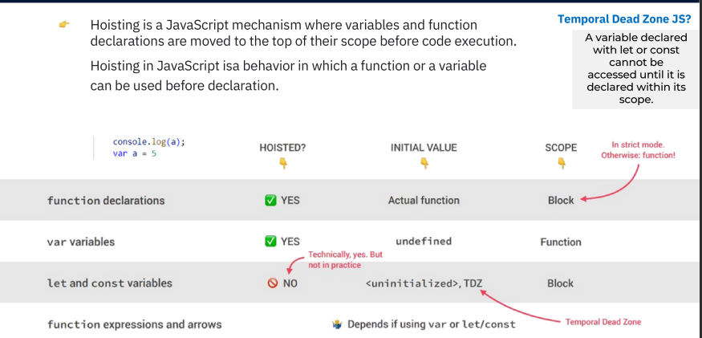

# TABLE OF CONTENTS
...
## Что такое Scope в JS ?
...
### Scope это как область или прицел или же скобки .
... 
### Скобки в JS делются на 4 типа :   1.Global scope   2.Function scope   3.Block scope   4.Module scope 
...
## Global scope : 
### Глобальные скобки это как интерфейс нашего компютера 
...
##  Что делают Глобальные скобки ?
### Если мы создадим какую либо переменную то наша переменная будет иметь доступ везде потому что она Глобальная , то есть что бы мы не создали в Глобальной скобке она будет иметь доступ везде
...
## Function scope :
### Скобки Функции , если внутри Скобки Функции мы создадим переменную с let и const то эти переменные будут работать только в нутри этой функции , то есть если мы вызовем переменную которая находится в нутри функции , в Глобальную скобку то она не будет работать , но если мы создадим внутри функции переменную var то её можно будет вызвать в Глобальную скобку потому что var это глобальная переменная а let и const локальная 
... 
## Block scope : 
###  Блок скобки , только if и for имеют Блок скобки 
...

...
## Hoisting in Js :
### Hoisting это когда мы вызываем функцию прежде чем мы его создадим , то есть функция внизу но мы его вызываем вверху 
...
### Hoisting работает только на Function declaration и на var 